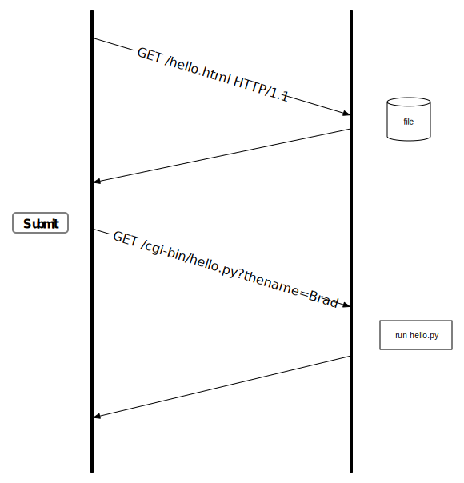

Processing user Input
=====================

In the Javascript chapter we looked at a number of HTML tags for processing user input.  If that user input needs to go back to the web server, then we need to enclose our input elements, and a submit button inside a ``form``.

When we submit a form, the browser packages up all of the data we have entered into the input elements and sends them back to the server, and your program for processing.

Let's change the hello.py program we wrote earlier to have a form where you can enter your name.  After you click on the submit button the page will display ``Hello yourname`` rather than ``Hello World``.  Although it sounds simple, this program will provide us with several avenues to further explore the relationship between the browser, the server, and our cgi program.

Let's start with a basic page with a form.

.. code-block:: html

   <html>
     <body>
         <form action='cgi-bin/hello2.py' method='get'>
             <label for="myname">Enter Your Name</label>
             <input id="myname" type="text" name="firstname" value="Nada" />
             <input type="submit">
         </form>
     </body>
   </html>
   
There are two important attributes on the form tag:

* method: this tells the browser which http method to use when submitting the form back to the server.  The options are ``get`` or ``post``.

* action: This tells the browser the URL to use when submitting the form.

The input type ``submit`` renders as a button in the form.  The purpose of this input type is to cause the form to be submitted back to the web server.

.. code-block:: python

   #!/usr/bin/env python
   import os

   print "Content-type: text/html\n"

   qs = os.environ['QUERY_STRING']
   if 'firstname' in qs:
       name = qs.split('=')[1]
   else:
       name = 'No Name Provided'

   print "<html>"
   print "<body>"
   print "<h1>Hello %s</h1>" % name
   print "</pre>"
   print "</body>"
   print "</html>"

The new cgi script must now check to see if the ``QUERY_STRING`` environment variable contains the string firstname.  Note that that firstname in the query string corresponds to the ``name`` attribute of the input element.  

When you press the submit button for a form, the web browser iterates over all of the input elements in the form, and collects the name value attributes of each.  These are put together into a string that becomes part of the URL.  The name value pairs are added after the usual URL information using the form:  ``?firstname=Sheldon&lastname=Cooper``  The ``?`` separates the query string information from the URL itself.  The ``&`` separates each name value pair.

The following figure gives you a good sense for the flow of how our little application works.

Combining into One File
-----------------------

Let's now combine our application into a single file. Using the following flow:

1.  If there is no QUERY_STRING simply return the HTML for the form.
2.  If there is a QUERY_STRING then do not display the form, simply display the Hello greeting to the name stored in the QUERY STRING.

Along the way we will clean up our code and refactor it into a couple of functions.

.. code-block:: python

   #!/usr/bin/env python
   import os

   headers = ["Content-type: text/html"]
   qs = os.environ['QUERY_STRING']

   def sendHeaders():
       for h in headers:
           print h
       print "\n"

   def sendForm():
       print '''
       <html>
         <body>
             <form action='cgi-bin/hellobetter.py' method='get'>
                 <label for="myname">Enter Your Name</label>
                 <input id="myname" type="text" name="firstname" value="Nada" />
                 <input type="submit">
             </form>
         </body>
       </html>
       '''

   def sendPage(name):
       print '''
       <html>
         <body>
           <h1>Hello {0}</h1>
         </body>
       </html>
       '''.format(name)

   if not qs:
       sendHeaders()
       sendForm()
   else:
       if 'firstname' in qs:
           name = qs.split('=')[1]
       else:
           name = 'No Name Provided'
       sendHeaders()
       sendPage(name)
   

The headers list is to set us up with a pattern that will be useful later.  Sometimes we don't know right away what headers we may want to send.  We'll see that in the next section.  So we can defer sending the headers until we have done all of our processing and are ready to send back the results.  To add a header to our response we can simply append the string to the list of headers.  

The other functions, ``sendPage`` and ``sendForm`` reduce the number of print statements we need by making use of Python's triple quoted strings, and `string formatting <https://docs.python.org/2/library/string.html#string-formatting>`_.

