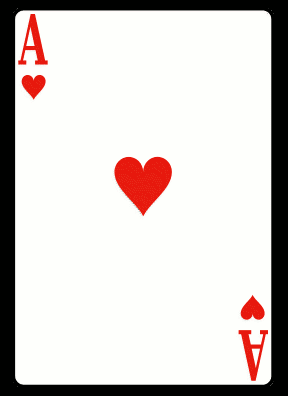

Changing your page layout
=========================

Before we go any further it is important to stop and think a bit about how the browser renders the html into the browser window.  As the browser reads each html tag, it must figure out where on the page it belongs.  For the most part, the browser flows each tag from top to bottom and from left to right.  As we have mentioned block elements start on a new line, and inline elements flow from left to right, fitting within the horizontal size of the page or else going on to the next line.  In this section we will consider several different CSS options that have an impact on the layout of a page.

The CSS Box Model
-----------------

All HTML elements can be thought of simply as boxes.  In fact that is exactly how the browser thinks of them as it begins the process of rendering the page.  When doing web page design and layout it is very common to hear designers talk about the CSS box model.  Figure 1 illustrates the different components that go into the box model.

.. figure:: Figures/box-model.gif

   Figure used in accordance with w3schools fair use policy

The different parts of the box model are defined as follows:

* Content:  The actual text or image content of an html tag
* Padding:  The space between the content and the border.
* Border:  This can be an actual drawn border or it can be invisible
* Margin: The space outside the border between this box and the boxes next to it in each direction.

Lets try a simple example:

.. activecode:: css_boxmodel
   :language: html

   <html>
      <head>
         
       </head>
   <body>

      <section>Hello World</section>
      <section id=b>Hello World</section>

   </body>
   </html>

As a bit of review, add a rule to the example above to make the margin for the second Hello world to be 5px.  What does this tell you about how margins work?

The size of content area itself can also be controlled using the following properties:

* height
* max-height
* min-height
* width
* max-width
* min-width

Each of these properties can be specified in terms of pixels (px), points (pt), or as a percentage.  In addition the auto keyword can be used, which is the default and allows the browser to figure out the proper height and width.

Display
-------

With CSS you can take control of how each element is layed out on the page.  You can hide elements, you can make block elements inline, and inline elements block.  There are two ways to control the visibility of an element.  You can completely hide it, as if it is not there and takes up no space on the page, or you can have the leave the space on the page, but it will not have anything in it.

.. activecode:: css_disp1
   :language: html

   <html>
      <head>
         
       </head>
   <body>

      <h1>Hello World One</h1>
      <h1 class="gone">Hello World Two</h1>
      <h1>Hello World Three</h1>
      <h1 class="gone">Hello World Four</h1>
      <h1>Hello World Five</h1>
   </body>
   </html>

Now change the rule and instead of ``display: none`` change it to ``visibility: hidden``  Notice that visibility hidden reserves space on the page for the element but does not show it.  Whereas the ``display: none`` rule removed any trace of the element.  Now change the rule to ``visibility: show`` to display all of the elements.

The display property can also be used to change block elements into inline elements.  Consider teh following example.

.. activecode:: css_disp2
   :language: html

   <html>
      <head>
         
       </head>
   <body>
      
There are 10 kinds of people in the world.
      <ol>
      <li>Those that know how to count in binary.</li>
      <li>Those that do not know how to count in binary</li>
      </ol>
      When you have stopped laughing, add a CSS rule that changes the display
      property for the ``li`` element and sets its value to ``inline``. 

   </body>
   </html>

Positioning
-----------

There are several different ways to affect the positioning of html elements either inside or outside of the normal flow of the layout.

* static
* fixed
* relative
* absolute

Static is the default positioning value for the css position property.  The static value simply tells the browser to position this element in the "normal flow" of the document.

Fixed positioning is measured against the frame of the browser window.  Elements with a fixed position value do not move even when the contents of the browser window are scrolled.  The navigation bar at the top of this page uses the fixed position value so it is always visible.  Because fixed elements are outside the flow of the document they can sometimes cause unexpected results that you have to deal with carefully.

A relatively positioned element is measured relative to its normal position in the flow.  Using a relative position value lets you create elements that overlap each other.

An absolute position element is positioned relative to the first parent element that has a position other than static. If no such element is found, the containing block is the ``html`` tag for the entire document.  Absolutely positioned elements are positioned outside the normal flow of the document.

.. activecode:: css_pos1
   :language: html

   <html>
      <head>
         
       </head>
   <body>
      
There are 10 kinds of people in the world.

      <ol>
      <li>Those that know how to count in binary.</li>
      <li>Those that do not know how to count in binary</li>
      <li>Those that know how to count in binary.</li>
      <li>Those that do not know how to count in binary</li>
      <li>Those that know how to count in binary.</li>
      <li>Those that do not know how to count in binary</li>
      <li>Those that know how to count in binary.</li>
      <li>Those that do not know how to count in binary</li>
      <li>Those that know how to count in binary.</li>
      <li>Those that do not know how to count in binary</li>
      <li>Those that know how to count in binary.</li>
      <li>Those that do not know how to count in binary</li>
      <li>Those that know how to count in binary.</li>
      <li>Those that do not know how to count in binary</li>
      <li>Those that know how to count in binary.</li>
      <li>Those that do not know how to count in binary</li>
      <li>Those that know how to count in binary.</li>
      <li>Those that do not know how to count in binary</li>
      <li>Those that know how to count in binary.</li>
      <li>Those that do not know how to count in binary</li>
      <li>Those that know how to count in binary.</li>
      <li>Those that do not know how to count in binary</li>
      </ol>
      
When you have stopped laughing, add a CSS rule that changes the display
      property for the ``li`` element and sets its value to ``inline``. 

   </body>
   </html>

When you run the example above you will notice that its not quite right!  The text is overlapping and the page generally looks ugly.    The elements overlap because the fixed positioning takes the paragraph block element out of the flow.  Because its out of the flow the browser renders the ``ol`` as if it should be the first thing at the top of the page.

Your challenge is to fix the example so that the sentence stays nicely anchored to the top, but the ordered list begins below it.

.. reveal:: css_pos_sol1

   Here is one way to solve this problem.  Add a rule for the ol that specifies a top-margin.  Make the top margin large enough so that the list starts below the first paragraph.  You may need to experiment a little bit with some different values before you find one that works well.

Next lets look at the relative position and how we can use it to make overlapping elements.

.. take an image of a card and make a stacked deck of three cards.

Lets make a stack of cards using the following image:

.. activecode:: css_pos2
   :language: html

   <html>
      <head>
         
      </head>
   <body>
      
      
      
   </body>
   </html>

If you run the example you will see the three cards lined up next to each other.  As a reminder this is because:

1.  images are inline elements and so do not create a line break.
2.  The browser lays out inline images top to bottom and left to right.

Now lets use our positioning skills to create a stack.  Modify the example above to add the following css rule:

.. code-block:: css

   img#b {
       position: relative;
       top: 20px;
       left: -100px;
   }

Great, now we have made the second card appear to be on top of the first.    Notice that although we have moved the second image, the position of the third image does not change.  This is because space is still reserved for the second image in its middle position, we are manually moving it relative to where it would normally be in the flow.  So a relative positioning works within the flow of the document.  Add a rule for the third image to add it to the stack.

.. reveal:: css_stack

   .. code-block:: css

      img#c {
          position: relative;
          top: 40px;
          left: -200px;
      }

Now, what about elements that come after relatively positioned elements?  If you add a paragraph after the images do you expect the text to be covered up or flowed beneath all of the cards?

Another important thing to notice is that card 2 appears to be stacked on top of card 1, and card three appears to be stacked on top of cards 1 and 2.  This is becuase elements that come later in the document naturally appear on top of elements that come before them.

If we want to change that and make it look like card 1 is on top of card 2 and card 2 is on top of card 3 we can use the css ``z-index`` property to position the elements.  elements that have a larger z-index will appear to be on top of items with a lower z-index.  By default, all elements have a z-idex of zero.  So to change the order of the stack we will need to modify the rules for images b and c.  Add a z-imaeg property to the ``img#b`` and ``img#c`` rules giving b a z-index of -1 and c a z-index of -2.

Floating
--------

The CSS float property allows us to push HTML elements to the left or right, so that other elements will wrap around them.  This can be extremely useful for images, but will also be very useful when we begin to work on more complex layouts for our pages.  Lets begin with a simple example.

.. activecode:: css_float1
   :language: html

   <html>
      <head>
         
       </head>
   <body>
   
the quick brown fox jumped over the lazy dog.  the quick brown fox jumped over the lazy dog.  the quick brown fox jumped over the lazy dog.   the quick brown fox jumped over the lazy dog. the quick brown fox jumped over the lazy dog. the quick brown fox jumped over the lazy dog.
   </body>
   </html>

Notice that the logo appears right in the middle of the text in its normal inline flow.   Now, add a CSS rule for an img tag that sets the float property to left.   Then change the rule to float the image to the right.

Next lets add a second copy of the norse logo to the page by copying and pasting the image again.

Next, modify the html, and add a CSS rule so that one logo is floated to the left and the other is floated to the right.

Full Page Layout
----------------

.. activecode:: css_layout1
   :language: html

    <html>
        <head>
            <title>Home</title>
            

        </head>
        <body>
            <header>
                A header that stays stuck to the top.
            </header>
            <nav>
                <ul>
                <li>About</li>
                <li>Papers</li>
                <li>Donate</li>
                </ul>
            </nav>
            <section>
                This would be a good place for a table of contents
            </section>
            <aside>
                This is the main content area
                
            </aside>
            <footer>
                Copyright Area, Contact Us.
            </footer>
        </body>
    </html>
