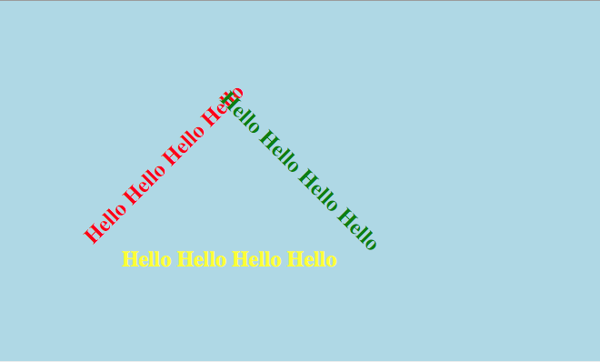

Quiz Two
--------

Today's quiz has only one question, you may use your textbook to refer to as well as other examples you may have saved from class.  I will use only your final result, so don't forget to save.   This may prove to be quite challenging, but don't worry, I will give plenty of partial credit.

Starting with the HTML I give you, you must recreate the image below.

Hint:  For Safari and Chrome the following property is important for this question:  ``-webkit-transform``  Also I will tell you that the Hellos are tilted by 45 degrees.  The rest of the positioning you can get by trial and error, there is no need for advanced math to figure this out.

.. actex:: q2_1
   :language: html

   <html>
     <head>
       
     </head>
     <body>
        <h1 id="a">Hello Hello Hello Hello</h1>
        <h1 id="b">Hello Hello Hello Hello</h1>
        <h1 id="c">Hello Hello Hello Hello</h1>
     </body>
   </html>