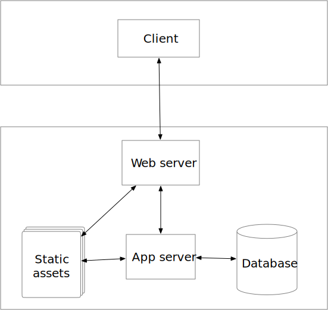

Modern Web Application Architecture
===================================

The diagram below illustrates a pretty standard web archictecture for the year 2018.  The tools and buzzwords may change but the basic structure has been the same for several years now.

CGI Stack
---------

CGI stands for Common Gateway Interface, and in the beginning (circa 1992) this was how dynamic webpages were generated.  The webserver would notice that the URL contained ``cgi-bin`` as part of the path and automatically "spin off" a perl script. The perl script would do something like this:

.. code-block:: perl

   print "Content-Type: text/html\n\n"
   print <<HTML;
   <html>
   <body>
   <h1>Hello World</h1>
   </body>
   </html>
   HTML
   exit;

The odd syntax (called a HEREDOC) not withstanding you can see that the script is basically just a couple print statements that follow the HTTP protocol and spew out HTML. The output from the print statement is directed back across the network rather than to a terminal screen.  On the other end of the wire the browser just knows it is getting HTML it has no idea that it came from a program rather than a file. Since the program **is** just printing out a string, where that string comes from and how that string is constructed gives you all the power you could ever want to generate a page on the fly.  The script could access a database, the script could compute anything you want and display the results using HTML to format them.  

LAMP Stack
----------

writing programs that generate web pages using print statements was OK, but definitely not something that many programmers wanted to do full time.  The rise in popularity of linux and other open source components such as the Apache web server, MySQL, and the PHP programming language brought about a real revolution in web development.  This combination of components became known as the LAMP stack, and has been a dominant architecture for developing web applications since around 2000.

* Linux
* Apache
* MySQL
* PHP

In this setup the web server would notice that that the URL ended in ``.php`` rather than ``.html`` and then send the file ending in ``.php`` through a php interpreter.  The php interpreter even came to be embedded in the web server so that there was no need to spin off a new process for every request.  The benefit/curse of php was that it mixed HTML and a programming language with many of the same features as perl or python.

.. code-block:: php

    <!DOCTYPE HTML>
    <html>
        <head>
            <title>Example</title>
        </head>
        <body>

            <?php
                echo "Hi, I'm a PHP script!";
            ?>

        </body>
    </html>

In the example above you can see that we don't need print statements for the vanilla HTML. But when we want to compute something or retrieve something from a database we do that inside the special ``<?php   ... ?>`` tag.   Just as in the cgi world the output from this php file were sent back to the unsuspecting browser as if it had just received a static page.

Over the years the LAMP stack has become an archetype for lots of different systems.  Nginx, Postgres and Python could replace Apache, MySQL and PHP and nobody would fault you for calling  your setup a LAMP stack.

As web development got more and more sophisticated over the years many different programming languages developed more sophisticated app servers.  The web server was relegated to serving static pages, and then handing off more complicated requests to a separate application server. You have heard of many of these such as Ruby on Rails (Ruby), Django or Flask (Python), Tomcat (Java) and many others.

MEAN / MERN Stack
-----------------

* Mongo DB
* Express.js
* Angular.js / React.js / Vue.js 
* Node.js

The LAMP stack was very good for generating pages and provided a certain level of interactivity, mainly through forms, but for many people the cycle of 

1. Look at a page 
2. Fill out a form
3. Submit the form
4. See the results

Although this is interactive for many people this felt like one step forward and 10 steps back for interface design. This model of interactiviy was more popular in the 70's and early 80's.  People wanted their menus and highly interactive interfaces.  This became possible when web browsers embedded the Javascript language.  This allowed a LOT of the computing to be moved the browser itself, and with the computing being closer to the user this allowed for a lot more interactive experience.  This gave rise to all kinds of applications that we use every day starting with gmail, Google Docs, Google Sheets and many others.  This gave rise to what many refer to today as the MEAN stack.  This follows the same basic architecture as the original diagram but the application server is primarily responsible for providing data to the javascript application that runs in the browser.  The MEAN acronym puts elements in a different order than LAMP and you can kind of think of Node.js taking the place of Linux, Mongo DB takes the place of MySQL, Express.js takes the place of the web server/application server, and Angular takes the place of PHP but it runs in the client rather than the server.  Another advantage (some say) of the MEAN stack is that every component is based on Javascript so as a developer you are primarily working in the same programming language.

Like the LAMP stack there are many tools that can fulfill the roles occupied by Mongo, Express Angular and Node.js.  You can write an app just as MEAN using Flask, Postgresql and Vue.js.

Becoming a Full Stack developer
-------------------------------

The rest of this book aims at moving you toward becoming a full stack developer, that is that you can write Javascript to create a user interface in the browser and then move your way down the stack to the back end to create API's (Application Programmer Interfaces) for the javascript to offload computing and storage tasks to the back end.

