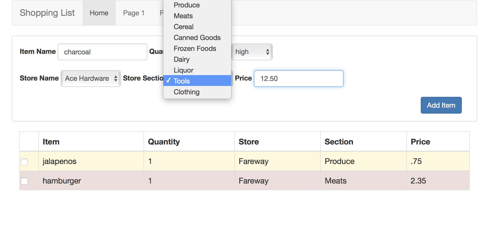

First Shopping List Prototype
=============================

Our first prototype looks like this:

If you are not familiar with the document object model you may want to review the sections in the Javascript chapter on events and creating elements on the fly.

Here is the html for this page:

.. code-block:: html

    <html>
        <head>
            <!-- https://www.w3schools.com/bootstrap/bootstrap_get_started.asp -->
            <title>Shopping List Application</title>
            <link rel="stylesheet" href="https://maxcdn.bootstrapcdn.com/bootstrap/3.3.7/css/bootstrap.min.css">
            <link rel="stylesheet" href="css/shoppingstyle.css">
        </head>

        <body>
            

                    <nav class="navbar navbar-default">
                            

                            

                                <a class="navbar-brand" href="#">Shopping List</a>
                            

                            <ul class="nav navbar-nav">
                                <li class="active"><a href="#">Home</a></li>
                                <li><a href="#">Page 1</a></li>
                                <li><a href="#">Page 2</a></li>
                                <li><a href="#">Page 3</a></li>
                            </ul>
                            

                        </nav>
                

                    

                    

                    

                        <label for="itemname">Item Name</label>
                        <input type=text class="form-control" name="itemname" id=itemname />
                    

                    

                    <label for="qty">Quantity</label>
                    <select name="quantity" id="qty" class="form-control">
                        <option value="1">1</option>
                        <option value="2">2</option>
                        <option value="3">3</option>
                        <option value="4">4</option>
                        <option value="5">5</option>
                        <option value="6">6</option>
                        <option value="7">7</option>
                        <option value="8">8</option>
                        <option value="9">9</option>
                        <option value="10">10</option>
                    </select>
                    

                    

                    <label for="priority">Priority</label>
                    <select name="priority" id="priority" class="form-control">
                        <option value="low">low</option>
                        <option value="medium">medium</option>
                        <option value="high">high</option>
                    </select>
                

                    

                    

                        

                        <label for="store">Store Name</label>
                        <select name="store" id="store" class="form-control">
                        </select>
                        

                        

                        <label for="category">Store Section</label>
                        <select name="category" id="category" class="form-control">
                        </select>
                        

                        

                        <label for="price">Price</label>
                        <input type="text" name="price" id="price" class="form-control">
                        

                    

                    

                    <button onclick="clickedon()" class="btn btn-primary" id=gobutt>Add Item</button>
                    

                    

                

                

                <table class="table table-bordered">
                    <thead>
                        <tr>
                            <th></th><th>Item</th><th>Quantity</th><th>Store</th><th>Section</th><th>Price</th>
                        </tr>
                    </thead>
                    <tbody id="shoppinglist"></tbody>
                </table>
                

            

            
            
            
        </body>
    </html>

A couple of things to note:  First notice that we've created an empty table with a ``tbody`` tag with an id of ``shoppinglist`` this gives us a place to start building our table.  Also notice that our add item button calls a function ``clickedon`` this function is defined in the shopping.js file and will handle creating a new row and appending it to the ``tbody`` each time we add an item.

Lets look more carefully at the code in shopping.js

.. code-block:: javascript

    var stores = ['Fareway', 'Ace Hardware', 'Caseys', 'The Hatchery', 'Amundsens']
    var sections = ['Produce', 'Meats', 'Cereal', 'Canned Goods', 'Frozen Foods', 'Dairy', 'Liquor', 'Tools', 'Clothing']

    function clickedon() {
        let rowcolids = ['itemname', 'qty', 'store', 'category', 'price']
        let vals = []
        for (let cid of rowcolids) {
            vals.push(document.getElementById(cid).value)
        }
        makeRow(vals, document.getElementById('shoppinglist'))
    }

    function makeRow(valueList, parent) {
        let row = document.createElement("tr")
        row.classList.add(document.getElementById("priority").value)
        let cb = document.createElement("input")
        cb.type = "checkbox"
        cb.classList.add("form-control")
        row.appendChild(cb)

        for (let val of valueList) {
            let td = document.createElement("td")
            td.innerHTML = val
            row.appendChild(td)
        }
        parent.appendChild(row)
    }

    function populateSelect(selectId, sList) {
        let sel = document.getElementById(selectId)
        for (let s of sList) {
            let opt = document.createElement("option")
            opt.value = s
            opt.innerHTML = s
            sel.appendChild(opt)
        }
    }

    $(document).ready(function () {
        populateSelect('store', stores)
        populateSelect('category', sections)
    })

There is plenty to think about in this example.  But lets begin with creating the select boxes.  For this bit of functionality I wrote a helper method called populate select.  This function can populate any select box given its id and a Javascript array of values.

.. activecode:: select1
    :language: html

    <select id="myid"></select>
    

This is a simple illustration of three highly used functions getElementById, createElement and appendChild.  These methods allow us to have javascript dynamically create tags and add them into our live document object model.

Next lets look at the ``clickedon`` function.  This function also relies on a helper to make a row and add the row to the table.  it does this by creating an array of values one array entry per table row cell.  then it calls its helper function which sets up the class for coloring the row, makes a checkbox, and appends a bunch of ``td`` elements to the new ``tr``.

The last few lines of this example show the use of jQuery to call the ``populateSelect`` functions after the rest of the page has been loaded and is ready to go.  This is a really common way of ensureing that you don't call Javascript functions that manipulate the DOM until the page is loaded and initially rendered.   Another way that many people do this is by using the ``onload`` event for the ``body`` tag.  But since we had to load jQuery for bootstrap I wanted to show this as well.  All this says is that when the ready event on the document object fires, call the function that populates the two select boxes.

Thats it for this prototype. And you may be thinking that we are nearly done, lets just hack out a few more lines to handle the checkbox and we are good to go.  But hang on, we're going to complicate matters in the next couple of sections by diving into some good design patterns that will make getting back to this point a good deal more complicated.

