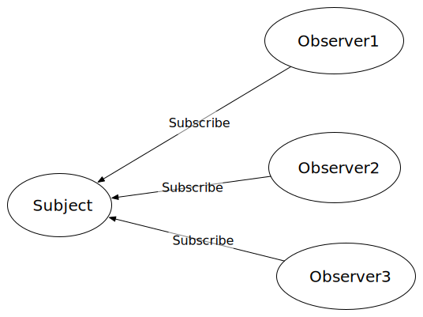
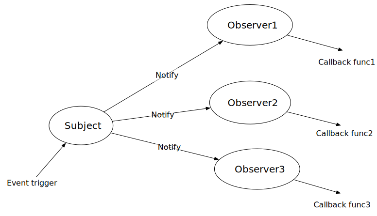
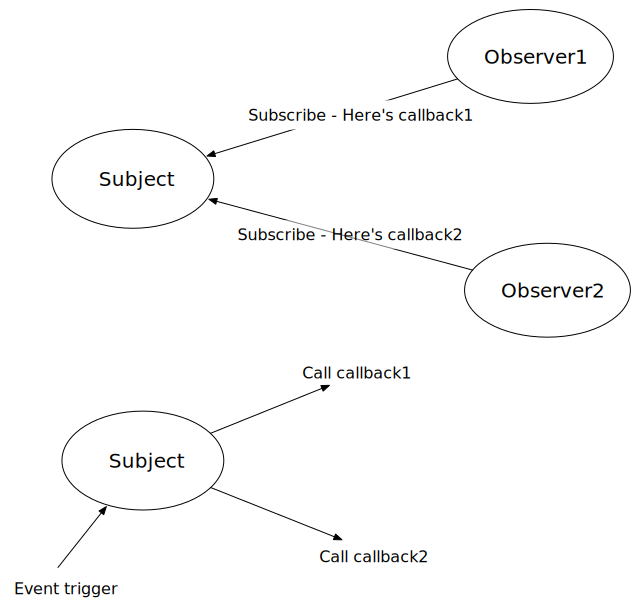

The Publish and Subscribe Design Pattern
========================================

You have already seen an example of a **callback function** in action, specifically, ``clickedon`` function that is called when the add button is pressed.  This is very common in event based programming.  Basic Javascript has the limitation that you can only assign one function to a particular event, and that assignment is closely tied to the creation of the HTML element.

What happens if you want multiple things to happen when an event happens?  What if you want to be able to add new callback functions some time after you the original element is created?  There is a design pattern called "Publish and Subscribe" that handles just such a situation.  the following diagram shows how this publish and subscribe pattern works.

In this first phase, we have one Subject in which three observers are interested.  The observers want to know when some event happens to the subject. Not unlike you subscribing to your friends on facebook or following them on twitter.  The point is that when they post something you want to be notified so you can see what happend.

The next diagram shows that notification process.  However the difference is that when notification happens the observers conceptually call a function. 

In the case of our web app, the subject is our model, specifically our shoppingList.  The observer, at the moment anyway, is the View.  Whenever an item gets added or subtracted from the shopping list the View wants to know about it so it can reddraw the table.

The following diagram gives you a better idea how this is implemented:

In essence when an observer subscribes to a subject it gives the subject a function to call back when some event happens later.  The subject keeps track of these various functions without having to even worry about which function belongs to which observer, and then when an event does happen it just iterates over the array of functions calling them one after the other.

Lets make a really simple example.

.. activecode:: Pubsub1
    :language: javascript

    class Subject {
 
        constructor() {
            this.handlers = []
        }

        subscribe(fn) {
                this.handlers.push(fn);
            }
        
        unsubscribe(fn) {
            this.handlers = this.handlers.filter(
                function(item) {
                    if (item !== fn) {
                        return item;
                    }
                }
            );
        }
        
        publish(msg, someobj) {
            var scope = someobj || window;
            for (let fn of this.handlers) {
                fn(scope, msg)
            }
        }
    }

    function callback1(a,msg) {
        alert("callback1:  the message is "+ msg)    
    }

    function callback2(a,msg) {
        alert("callback2:  the message is "+ msg)    
    }

    sub = new Subject()
    sub.subscribe(callback1)
    // time passes
    sub.publish("event 1 happened")
    sub.subscribe(callback1)
    sub.publish("event 2 happened")

For the first event there was only one subscriber.  Then we added a second subscriber and both were called.  The Subject class is very useful and can be used as a parent for any class that you want to act as a subject.  In our project the shopping list will be that subject and will inherit from the Subject class.

