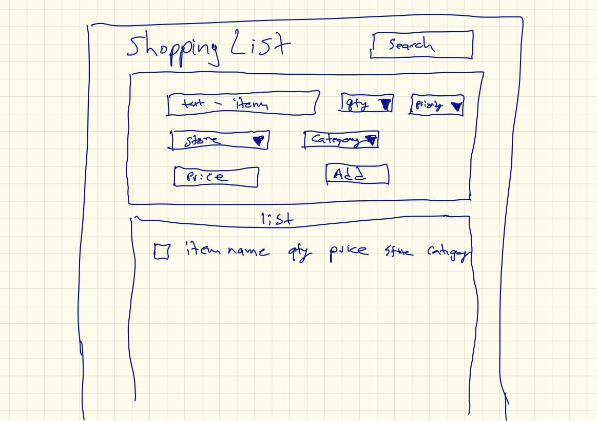

A trip to the SPA
=================

Many smaller modern apps reside mostly in the browser using Javascript to make the application highly interactive.  These applications have come to have the acronym SPA which stands for Single Page Application.  The name comes from the fact that you only load the page from the server once and the Javascript takes care of the rest.

The approach we will take in the next several sections will be to build a shopping list application from the ground up.  We'll start really simple (really really) and work our way towards something much better.  If this is your first time using Javascript this will introduce you to many of the key Javascript functions used to dynamically create interactive pages.

Let's start with a high level design and then we'll iterate through many different improvements.

Here is a sketch of what the interface should look like.

We will have an upper panel for data input where we can type in the item name, select a quantity from a dropdown menu, set a priority as well as a store, section, and price of the item.  When the user clicks on the add button a new entry will be made in the table in the lower panel with the following requirements:

* Add a checkbox on the left so the item can be marked as purchased.
* Use the priority to color code each item.
* In the future we'll add a mechanism to edit an entry in the table.

Otherwise just display the information in a table as shown in the diagram.

In the upper panel it's OK to hardcode the quantity as the number 1 through 10 and the priorities as high, medium and low.  But we will want to make the selections for stores and store section configurable so we will dynamically generate those elements.  In addition we'll use some bootstrap to add a bit of style to our page.

Finally, we are going to want to be able to save our shopping list.  We'll ignore this requirement for the first couple of iterations and then come back and add it.
