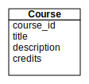
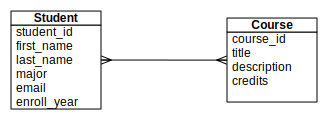
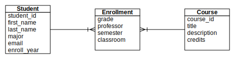

Persistent Data and Datbases
============================

In the three legged stool of web applications, we have covered both the view and the controller.  We have even built simple apps with very simple models.  But now it is time to look at a real model, and how a database management system is used in a web application.   We will divide this chapter into three modules:

1.  Data Modeling and Creating a Database
2.  Querying the database using Python's DBAPI
3.  Using an Object Relational Mapping layer such as SQLAlchemy

Data Modeling
-------------

Let me begin with the statement that data modeling could be the most important skill you learn in your computer science career.  If you understand your (or your customer's) data, and can effectively communicate to your customer about their data you have already won half the battle.  Data modeling is an excellent communications tool, both to help you uncover hidden requirements and assumptions, and to facilitate good understanding between you and those you are working with.

A data model will help us uncover and describe the entities that are important to our application.  These entities will become the tables in our database.  The things we need to remember about the entities or the attributes of our entities will become the columns in our table.

Lets use an example of keeping track of college courses to illustrate what we mean.  To start out very simply we think of the nouns or things that are important to registering for courses at college.

* student
* course
* grade
* professor
* department
* major
* requirement
* pre-requisite
* classroom
* time

When doing a data model we often create a diagram to represent the data model called a logical data structure (LDS)  An LDS is a simple notation that aids in the modeling and design task without being so complicated as to get in the way.

Looking at our list, the first thing we may want to investigate is the course.  What is it about a course that uniquely identifies it?  What other things do we want to remember about a course.  At most colleges courses have unique identifiers that consist of the department and a number such as CS101 or BIO423.  For a course we may also want to remember the title of the course, the course description, how many credits the course is worth.  

Other attributes of the course may be the professor who teaches it, the room the course meets in, and the time.  However these are slightly problematic in that these things change from time to time.  Now if we don't care about that and only want to remember the most current room or professor its not a problem, but if we want to be able to look back and find out who taught a course where and when we'll have to defer these attributes for a while.

Lets begin our LDS diagram by drawing out the Course entity along with its attributes.

   An LDS with one entity
   
To continue thinkgin about the course another idea that may have occured to you is that we want to remember the students that took the course.  So, student is an attribute of course.  However, when you think about student you can probably think of many things ou wold want to remember about a student, so its no ordinary attribute.  In fact it is another entity.

A student is uniquely identified by their student id, and there are lots of things to remember:  first Name, last name, the year they enrolled, their major, their email address, and potentially much more.  However, how do we indicate that there is a relationship between a student and a course?  What kind of relationship?  There are three different relationships to consider:

* one to one
* one to many
* many to many

To figure out the kind of relationship we have we need to ask the following questions:  Does a course have only one student.  Most of the time no.  Does a course have many students?  Yes.  So we know that this relationship is at least a one to many relationship.  But now we need to ask the question from the other perspective. Does a student take just one course?  Probably not.  Does a student take many courses.  Yes.  So we have a many to many relationship.  This looks like the following figure:

   An LDS with a many to many relationship
   
In the case of a many to many relationship we are *almost never* done at this point.  Inevitably, there is more that we want to remember about this relationship, or there is a name we want to assign to the relationship.  In this case the many to many relationship represents a student enrolling in a course.  So an enrollment is a new and important entity.  The enrollment represents a student taking a course.  Now there are things we want to remember about this occurrance.  When did the student take the course?  What grade did they receive?  What room was the course taught in?  Who taught the course?  With this in mind, we evolve or LDS to look like the following:

   An LDS with an evolved many to many relationship

OK, we've barely scratched the surface of data modeling, and yet this example is illustrative of a huge fraction of the kinds of relationships that you will see in the real world.  If you don't know any more than this, you can already model a lot of applications.

The Physical Database
---------------------

Having looked at the logical structure of our course application let us know think about its physical representation, that is how it is represented in the computer or on the disk of the computer.  For purposes of this chapter we will consider the physical representation in a relational database such as Postgresql, Mysql, or Sqlite3.  

Each of the entities in our logical data structure becomes a **table** in the relational database.  That is each instance of an entity is a row in the table and each of the attributes are a column.  For example some instances of our course entity would look like this:

=========  =========================  =============  =======
Course_id  title                      description    credits
=========  =========================  =============  =======
CS150      Intro to Computer Science  A great class   4
CS130      Web Programming            description     2
BIO101     Something about Biology    it bleeds       4
CHEM1      Chemistry                  it smells       4
=========  =========================  =============  =======

You should be able to draw a similar table for a student.  But what about the enrollment table?  The enrollment table is a bit different because it is the target of two one to many relationships.  In a one to many relationship the identifier from the "one" side of the relationship must be added to the table on the many side.  If we have student 1234 who has taken CS150, and CHEM1, and student 4567 who has taken CS130 and CHEM1 our enrollment table would look like this:

=========  ==========  ====== ========== ============ ========
Course_id  Student_id  Grade  Professor  Classroom    Semester
=========  ==========  ====== ========== ============ ========
CS150      1234        B+     Miller     Olin 202     Fall14
CHEM1      1234        B      Rinco      Valders 117  Spr14
CS130      4567        A      Miller     Olin 112     Fall14
CHEM1      4567        B      Rinco      Valders 117  Spr13
=========  ==========  ====== ========== ============ ========

