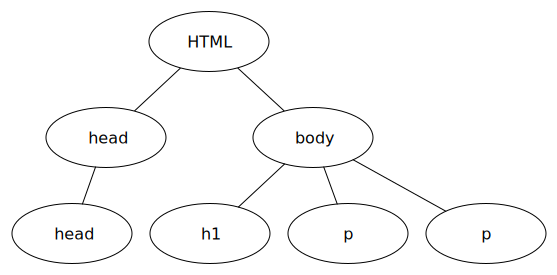

The HyperText Markup Language
=============================

As we noted in the previous chapter, HTML is the language of the web for expressing content. But before we dive into the specifics of HTML, let's look at what we mean by a markup language in general.  A markup language is a language that **annotates** text so that the computer can manipulate it for some purpose.  Most markup languages are readable by humans and are designed to be written with a plain text editor as rather than a fancy word processor like Microsoft Word.

This book is written using a markup language called `restructuredText <http://sphinx-doc.org/rest.html>`_ restructuredText is similar to another very popular markup language called `Markdown <http://daringfireball.net/projects/markdown/syntax>`_.  Both of these languages are designed to be easily readable by humans, and yet easily translate into our language of choice for this class, HTML.  Now you know about three markup languages:

* HTML
* Markdown
* restructuredText

The restructutedText markup for the content in this chapter so far looks like this:

.. code-block:: rst

   The HyperText Markup Language
   =============================

   As we noted in the previous chapter, HTML is the language of the web for expressing content. But before we dive into the specifics of HTML, let's look at what we mean by a markup language in general.  A markup language is a language that **annotates** text so that the computer can manipulate it for some purpose.  Most markup languages are readable by humans and are designed to be written with a plain text editor as rather than a fancy word processor like Microsoft Word.

   This book is written using a markup language called `restructuredText <//http://sphinx-doc.org/rest.html>`_ restructuredText is similar to another very popular markup language called `Markdown <http://daringfireball.net/projects/markdown/syntax>`_.  Both of these languages are designed to be easily readable by humans, and yet easily translate into our language of choice for this class, HTML.  Now you know about three markup languages:

   * HTML
   * Markdown
   * restructuredText

   The restructutedText markup for the content in this chapter so far looks like this:

The annotations in the restructuredText are pretty unobtrusive, and actually add to the readability of the plain text in most cases.  For example the ``===`` below the title of this chapter indicate that it is, in fact a title or heading.  regular paragraphs require no extra annotation.  To make something bold you surround it by double asterisks.  If you want to make a bullet list, you just start the line with an asterisk.

Most documents have a reasonably limited set of elements including the following:

* Paragraphs
* Title
* Headings and subheadings and subsubheadings
* bullet lists
* numbered lists
* tables of data
* figures or images
* text that is bold, or italic
* page headers
* page footers

As we learn HTML it's important to keep in mind that the job of html is to structure the document and provide content.  We'll worry about making things look pretty until we get to CSS.

HTML uses a set of tags to annotate(mark up) the document.  The tags all look like this:  ``< tagname >`` and they are balanced so that at the end of the content for that tag there is ``</ tagname >``.  Notice that the closing tag contains a  slash at the beginning to differentiate itself from an opening tag.

An HTML document then just contains a series of these balanced tags.  Let's look at a small document that looks like this:

My First Heading
----------------

A simple paragraph of text.

Another paragraph of text.

The HTML for this document is as follows:

.. activecode:: html_1
   :language: html

   <html>
       <head>
           <title>Test Page</title>
       </head>
       <body>
           <h1>My First Heading</h1>
           
A simple paragraph of text

           
Another paragraph of text

       </body>
   </html>

If you click the run button you will see the HTML in the example above in a special output window that mimics your browser.  Try changing the text of one of the paragraphs and click run again.   Try changing the ``h1`` tag to ``h2``  Don't forget to change both the opening and closing tags.   I have indented the HTML for you so you can see the opening and closing tags more clearly.  A web browser does not care about indentation one bit, you can get rid of all of the indentation, or put everything on one line and the page will still look the same.

Before we move on to talk more about specific HTML tags it's useful to think about the page that is produced and the structure of the page.  You get a sense of the structure from the indentation I have provided, but it's useful to look at this from another perspective.  Figure 2 illustrates a "tree view" of an HTML page.

   Figure 2.  A tree view of the html page

This tree is upside down with how we usually think of a tree, but in computer science we put the "root" of the tree at the top.  So the root of this tree is the html tag.  The html tag has two **children**, the head and the body.  The head has one child, which is the title tag.  The html tag is the **parent** of the head tag.  The body has three children, the h1 tag and two p tags.  You may also find it helpful to think of this as an outline, although you would have to rotate the picture 90 degrees counter clockwise to get the orientation into outline form.  We will see how this tree structure of an html page is useful later on when we start to use CSS and Javascript.

