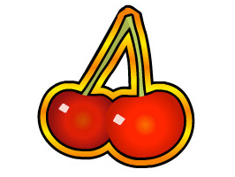
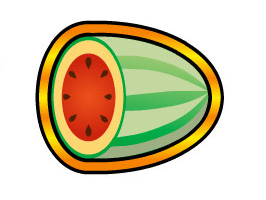
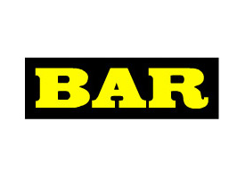
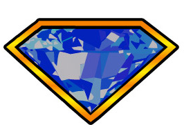

Javascript Project Slot Machine
-------------------------------

   

   

   

Let's go to Vegas.   In this section we are going to create our own video slot machine.  Like all web projects we will start simple and work our way up to a more complicated project.  Ultimately what we build is going to look like the following:

Let's start by displaying one of two possible slot machine images, that we will randomly select.

.. activecode:: slot_1
   :language: javascript
   
   getImage = function() {
      imgarray = Array("../_images/seven.png", "../_images/watermellon.png",
      "../_images/cherry.png", "../_images/bell.png",
      "../_images/diamond.png", "../_images/bar.png");
      
      rNum = Math.floor(Math.random()*imgarray.length);
      return imgarray[rNum];
   }
   
   d = document.getElementById("slot_1_js");
   iTag = document.createElement("img");
   iTag.src = getImage();
   d.innerHTML = "";
   d.appendChild(iTag);

.. raw:: html

   

.. activecode:: slot_2
   :language: javascript
   
   count = 0;
   
   getImage = function() {
      imgarray = Array("../_images/seven.png", "../_images/watermellon.png",
      "../_images/cherry.png", "../_images/bell.png",
      "../_images/diamond.png", "../_images/bar.png");
      
      rNum = Math.floor(Math.random()*imgarray.length);
      return imgarray[rNum];
   }
   
   swapImage = function() {
       d = document.getElementById("slot_2_js");
       iTag = document.createElement("img");
       iTag.src = getImage();
       d.innerHTML = "";
       d.appendChild(iTag);
       count++;
       if(count > 50) {
           window.clearInterval(intId,100);
       }
    }
    
    intId = window.setInterval(swapImage)

.. raw:: html

   

