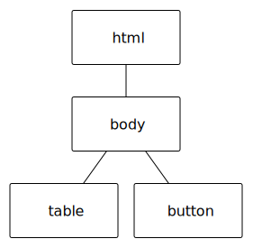
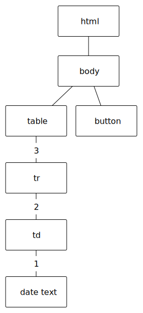

Creating Elements on the Fly
============================

The pattern in the previous example is a common one in web development.  You create a template using HTML and then you modify the template in response to events, gaining access to those elements using the ``querySelector`` method.

Modifying a template only gets us so far.   In many other cases you want to add content to your page dynamically.  For example, let's make a simple time application that records the date and time whenever you press the button.  

.. activecode:: create_1
   :language: html
   
   <html>
      <body>
          <button onclick="savetime()">Time</button>
          <table id="timetable">
          </table>
          
      </body>
   </html>

Although it's not a very useful application, it illustrates how we can create HTML elements in response to events.  Figure 1 shows the  DOM tree before the button is clicked.

   Figure 1, DOM tree before click

**Creating an Element**  The ``document.createElement`` function can be used to create any HTML element.  You can create an h1, a table, a paragraph, an input, even a button.  Once created, the new element is not yet part of our document tree. That is why we need to assign this newly created element a name.  In the example above, we create a ``tr`` and call it trow and a ``td`` which we name td.  We can assign values to any of the attributes of the element at this point.

**Creating Text**  We also used the function ``document.createTextNode`` to create the text we are going to put in the table.  We could have also used ``td.innerHTML`` to accomplish the same thing, but creating a ``textNode`` is another way to do the job.

**Adding to the Tree**  Now that we have our new pieces for our page we need to put things back together.  the ``appendChild`` function allows us to add to the tree by adding children one at a time.  Figure 2 shows the new DOM tree, and shows the order in which the nodes are connected together.

   Figure 2, DOM tree after click

Which Button?
-------------

Consider the following code.  We have two buttons, we would like the attach the same function to
both buttons, but when we click we would also like our function to know which button was clicked.

.. activecode:: button_context_1
   :language: html

   <html>
      <body>
          <button onclick="hello()">Button1</button>
          <button onclick="hello()">Button2</button>
          
      </body>
   </html>

How can we modify the example so that it knows which button was clicked?  We can use a parameter.

What is ``this``?
~~~~~~~~~~~~~~~~~

The parameter we can use in our example above is ``this``, which is a much used variable name in Javascript,
but also quite confusing.  You can think of ``this`` as a self-reference.  This answers the "who am I?" question
for an object.  From HTML we can pass this as a parameter to an onclick function, and because the onclick
is part of the tag ``this`` refers to the tag.   Important Note:  In most cases we have said that the
name of a variable does not matter;  ``this`` is the exception to that rule!

Modify the example above so that in each case you are calling ``hello(this)``.  Now in your javascript change
the alert to ``alert("Hello I am " + me.innerHTML)``

For comparison, let's create the same page as above but in Javascript.

.. activecode:: button_context_2
   :language: html

   <html>
      <body>
          
      </body>
   </html>

When we are creating elements in Javascript our task is a bit easier.  Because the ``this`` variable
is automatically set for us inside the function based on the object it is attached to.

Attaching Events
----------------

What if we want to attach an event to one of the objects we have created?  what if we want to use one function but attach it to many different elements, and have our function do something different depending on which element is clicked on?  This is the final topic for this section.  It's a tricky one, so pay close attention.  Let's start by attaching an onclick handler to each row of the table.

.. activecode:: create_2
   :language: html
   
   <html>
      <body>
          <button onclick="savetime()">Time</button>
          <table id="timetable">
          </table>
          
      </body>
   </html>

This example has a new function called clickon, right now, all it does is pop up an alert dialog box that says Hello whenever you click on a row of the table.  The line that attaches this function to the row is ``td.onclick = clickon;``  That is not a typo that line is correct.  clickon is just a name for a function so we can use that name to assign to other attributes.  It is only when the parenthesis are put after the name that we call the function.

.. admonition:: Key Point

   When an event handler is called, it's called within the context of the element that was clicked on. So, the identifier ``this`` will refer to the DOM element that you clicked on. You can then access attributes of the element using ``this`` as the identifier.  For example ``this.className`` will give the class of the element you click on.
   
Using the key point from above we can change our clickme function as follows:

.. code-block:: javascript

   clickon = function() {
       message = this.innerText;
       alert("the time is " + message);
       alert("my parent is a " + this.parentNode.tagName)
   }  
   
Modify the code in the example to match the above and then run it.  Notice that when you click on different rows of the table, you get different messages in the alert dialog box.  Notice that it also knows where it lives in the DOM tree, and can get its parent or even its siblings.
