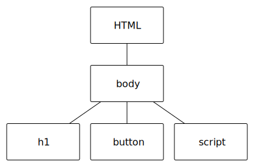

Objects Attributes and Methods
==============================

In the previous section we had the following example:

.. activecode:: js_hello2
   :language: html
   
   <html>
      <body>
         <h1>Hello World!!</h1>
         <button onclick="changeThisPageFunc();">Click Me!</button>
         
      </body>
   </html>
   
   
If you think about the HTML only, and what kind of tree you get from the document you will get something like this:

In the previous example we have a name ``document`` as you may have guessed this document name refers to the entire HTML document (or page).  More technically, document is a name that refers to an **object**.  That object is the representation of the page.

Earlier we said that objects know things, and know how to do things, the terminology for the things that objects know is that objects have **attributes** attributes on objects serve the same purpose as attributes of tags, they contain some property of the object.   For example ``document.height`` tells us how many pixels high the entire page is.  Our example illustrates several other attributes:

* document.body
* document.body.style
* or more specifically document.body.style.backgroundColor  (and the others you probably discovered)
* document.body.innerHTML

We can use these attributes in two ways.  First, we can use attributes to ask the object a question.  For example  ``document.body.style.backgroudColor`` could be interpreted as asking the document "tell me your background color". 
On the other hand  ``document.body.style.backgroundColor = "lightblue"`` should be interpreted as "set your background color to lightblue".

The key difference between the two interpretations in the preceeding paragraph is where the attribute is used in relationship to the equal sign. In fact the statement ``document.body.style.backgroundColor = "lightblue"`` is a special and very common programming statement called an **assignment statement**.

Now, you may also be wondering about the ``.`` between the various attributes in the statement.  You should read the dots between the attributes as:  document object (dot) return your body object (dot) return your style object (dot) return your backgroundColor object.

The innerHTML attribute allows us to change the html of any element in our document.  Of course as you noticed before changing the HTML value of the body wipes out all of the old tags and replaces it with whatever is in quotes.  Let's look at another example that illustrates another very important javascript function and will allow us to change only a small portion of the webpage.

Our goal is to change the ``h1`` without changing the rest of the page.  Let's try an approach that might seem clear to you now, that **will not work.**

.. activecode:: js_hello3
   :language: html
   
   <html>
      <body>
         <h1>Hello World!!</h1>
         <button onclick="changeThisPageFunc();">Click Me!</button>
         
      </body>
   </html>

The reason this will not work is that the body may contain many ``h1`` tags.  So we need a way to identify, and "get a handle on" the exact h1 that we want to change.

Let's look at the right way to do this.  IN the following example we have a semantic tag called ``main`` we want to change the contents of main without modifying the rest of the document.

.. activecode:: js_selector
   :language: html
   
   <html>
      <body>
         <h1>Hello World!!</h1>
         <button onclick="changeThisPageFunc();">Click Me!</button>
         <main>
            <h1>Hello Main</h2>
            
The quick brown fox jumped over the lazy dog.

         </main>
         
      </body>
   </html>

Our function has grown!  But, don't let that worry you, we have added more assginment statemetnts that only change the ``main`` tag.  However we have introduced one very significant new programming feature into this example.  ``myMain`` is a **variable**.  Variables are names that we give to Javascript objects, in this case it is the ``main`` tag.  Now, given what you know so far, you might wonder why not just use ``document.body.main``?  Because it does not exist.  The document object has a ``body`` attribute because all documents have a ``body``, but not all documents have a ``main``.  

So, we need to find the main in our document and give it a name so we can do things with it.  This is what is going on in the statement:  ``myMain = document.querySelector('main');``  Assignment statements work as follows:

1.  evaluate whatever is to the right side of the ``=`` assignment operator.
2.  Make the name on the left hand side of the assignment refer to the result of 1.

Now, the right hand side of the assignment statement contains a **method**. This is a fancy word for us telling an object to go do something for us.  In fact a method is just a fancy name for a function that is attached to an object, and so it is an abstraction too.  Now, here is the good news about this method.  Everything you learned about selectors in the previous chapter on CSS can be used to tell this method what you want it to find!   ``'main'`` is a parameter to the querySelector method, and could contain any selector we learned about in the previous chapter.

In fact ``document.head`` and ``document.body`` are the only tags that we can access directly.  All other tags must be accessed using ``querySelector``

Let's take a breather here and try a few things:

1.  Go back and modify the first example so that You can change the color of the h1.
1.  Change the HTML so that main has an id of ``"a"``.  Also add a second ``main`` tag that contains an h1.  The initial view of your page should not change.  What happens when you click the button?
2.   Now change the parameter to the querySelector method so that it finds main by its ID rather than by its tag?  What happens if you remove the id attribute from the first main and move it to the second?
