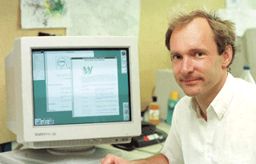

History
=======

Tim Berners-Lee invented the World Wide Web in 1989, about 20 years after the first connection was established over what is today known as the Internet. At the time, Tim was a software engineer at CERN, the large particle physics laboratory near Geneva, Switzerland. Many scientists participated in experiments at CERN for extended periods of time, then returned to their laboratories around the world. These scientists were eager to exchange data and results, but had difficulties doing so. Tim understood this need, and understood the unrealized potential of millions of computers connected together through the Internet.

   Tim Berners-Lee

Tim documented what was to become the World Wide Web with the submission of a proposal to his management at CERN, in late 1989 (see the proposal.), This proposal specified a set of technologies that would make the Internet truly accessible and useful to people. Believe it or not, Tim’s initial proposal was not immediately accepted. However, Tim persevered. By October of 1990, he had specified the three fundamental technologies that remain the foundation of today’s Web (and which you may have seen appear on parts of your Web browser):

* HTML: HyperText Markup Language. The publishing format for the Web, including the ability to format documents and link to other documents and resources.

* URI: Uniform Resource Identifier. A kind of “address” that is unique to each resource on the Web.

* HTTP: Hypertext Transfer Protocol. Allows for the retrieval of linked resources from across the Web.

Tim also wrote the first Web page editor/browser (“WorldWideWeb”) and the first Web server (“httpd“). By the end of 1990, the first Web page was served. By 1991, people outside of CERN joined the new Web community. Very important to the growth of the Web, CERN announced in April 1993 that the World Wide Web technology would be available for anyone to use on a royalty-free basis.

Since that time, the Web has changed the world. It has arguably become the most powerful communication medium the world has ever known. Whereas only 25% of the people on the planet are currently using the Web (and the Web Foundation aims to accelerate this growth substantially), the Web has changed the way we teach and learn, buy and sell, inform and are informed, agree and disagree, share and collaborate, meet and love, and tackle problems ranging from putting food on our tables to curing cancer.

Tim Berners-Lee and others realized that for the Web to reach its full potential, the underlying technologies must become global standards, implemented in the same way around the world. Therefore, in 1994, Tim founded the `World Wide Web Consortium (W3C) <http://w3c.org>`_ as a place for stakeholders to reach consensus around the specification and guidelines to ensure that the Web works for everyone and that it evolves in a responsible manner. W3C standards have enabled a single World Wide Web of information and people, and an increasingly-rich set of capabilities: Web 2.0 (personal and dynamic), Web 3.0 (a semantic Web of linked data), Web services, voice access, mobile access, accessibility for people with disabilities and for people speaking many languages, richer graphics and video, etc. The Web Foundation supports the work of W3C to ensure that the Web and the technologies that underpin it remain free and open to all.

With over 1 trillion public pages (in 2008) and 1.7 billion people on the Web (in 2009), we do not really understand how these pieces work together and how to best improve the Web into the future. In 2005, Tim and colleagues started the Web Science Trust (WST). WST is building an international, multidisciplinary research community to examine the World Wide Web as “humanity connected by technology”. WST brings together computer scientists, sociologists, mathematicians, policy experts, entrepreneurs, decision makers and many others from around the world to better understand today’s Web and to develop solutions to guide the use and design of tomorrow’s Web. The Web Foundation believes the discipline of Web Science is critically important to advancing the Web, and supports WST‘s efforts to build and coordinate this new field of study.

Most of the history of the Web is ahead of us. The Web is far from reaching its full potential as an agent of empowerment for everyone in the world. Web access through the world’s 4+ billion mobile phones is an incredible opportunity. New Web technologies will enable billions of people currently excluded from the Web community to join it. We must understand the Web and improve its capabilities. We must ensure that Web technologies are free and open for all to leverage. The work of the Web Foundation aims to have a substantial, positive impact on all of these factors, and on the future history of the Web.

References

* `A Little History of the World Wide Web <http://www.w3.org/History.html>`_
* `W3C’s 10th Anniversary <http://www.w3.org/2004/09/W3C10.html>`_ (`timeline <http://www.w3.org/2005/01/timelines/timeline-2500x998.png>`_)
* `“Weaving the Web” by Tim Berners-Lee <http://www.w3.org/People/Berners-Lee/Weaving/Overview.html>`_

.. admonition:: World Wide Web Foundation

   The source for this page is used under a creative commons 4.0 license.  Attribution is given to the world wide web foundation:  https://webfoundation.org/about/vision/history-of-the-web/
