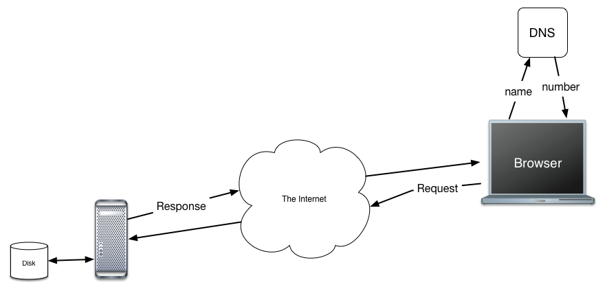

.. This work is licensed under a Creative Commons Attribution 4.0 License
   Brad Miller, Luther College

The Technology of the Web
=========================

We now return to the question of how a page gets from the server to your browser.   Let's use the idea of a URI as our starting point for this section.  In fact let's start by addressing a very common point of confusion  What is a URI and what is URL, you probably more commonly think of URL's.

* URL - Uniform Resource Locator
* URI - Uniform Resource Identifier

All locators are also identifiers, so all URLs are URI's. Think about it this way, Bradley Miller is an identifier, it identifies me, but does not tell you how to locate me or how to contact me. 321 Olin Hall, Luther College, Decorah IA, is a locator and an identifier for a specific place in the world.  On the web URL's have three main pieces, let's look at one and identify the parts:

::

    http://interactivepython.org/runestone/static/webfundamentals/index.html

This is a common URL with three parts:

* ``http``  This part identifies the protocol that will be used for communication.  It seems a bit redundant when we are always thinking about the web, but in fact there are several common protocols that are used in URL's including ``https`` for secure http communication, ``mailto`` to indicate that we are going to use a mail protocol, ``ftp`` the file transfer protocol.

* ``interactivepython.org`` This is the name of a host on the web.  Host names must be unique, there is only one interactivepython.org on the entire internet.  If you dig more deeply you can find out that this name translates to a numeric address.  If you have ever tried to configure your home router, or looked at the settings on your computer or phone you have undoubtedly come across these numeric addresses before.  In the case of interactivepython.org the numeric address is 108.168.242.153.  This numerica address is also unique in all of the internet, and  identifies a specific server running in a server room in Dallas TX.

* ``runestone/static/webfundamentals/index.html`` identifies a particular file on the server.  The server has a runestone folder, and inside that folder is another folder called static, which contains another folder called webfundamentals which finally contains a file called index.html.  This is no different than how you probably organize your own files on your own computer.

This URL contains **a lot** of information.  When you type this into the address bar of your browser you have given your browser enough information to get the specific page you wanted.  A diagram will help with the next part of this discussion.

Let's suppose we continue with the URL above.  You, the user, type in the URL to your browser, The browser knows that the host name is the part that comes after the first two slashes, but before the next slash.  So it is able to extract that part of the URL.  Using patterns like this occurs frequently in Computer Science.  The name is then passed on to another server called the Domain Name Service (DNS) in the diagram above.  The DNS is actually very large and complex network of servers, but we'll just take it for granted that it works and gives us back the IP address correctly.  With the address in hand, the browser establishes a connection to the server through a mechansim known as a **socket**.  This socket allows the browser and the server to reliably communicate over the internet.

An HTTP Request
---------------

With the connection established the browser sends the following message::

     GET runestone/static/webfundamentals/index.html HTTP/1.1
     Host: myname.luther.edu
     User-Agent: Mozilla/6.0
     Accept-Language: en
     _

The format of this message is defined by HTTP.  Remember a protocol is a well defined set of rules for how one program communicates with another.  Let us break down this message into its component parts.

* ``GET``  -- HTTP defines several commands, but the most common are GET and POST.  As you might imagine, GET is a request to retrieve some resource from the server.
* ``runestone/static/webfundamentals/index.html``  This is the URI for the resource that we want to get.  Recall that this will correspond to a file on the disk drive of the server.
* ``HTTP/1.1`` tells the server that the browser is "speaking" the 1.1 version of the HTTP protocol.

This is all of the information that can be contained on the first line of the message.  If there is anything else on the line it may confuse the server, or the server may just ignore it.  This line is called the **request line**.

What follows the request line are a series of lines called the **headers**  There may be just one header or there may be many.  However, there can only be one header per line and they all follow the pattern of ``name : value``.  So the first line the name is ``host`` and the value is ``myname.luther.edu`` this lets the server know the name of the namchine that is contacting it.  The ``User-Agent`` header tells the server that the user is running version 6.0 of the mozilla browser.

Finally the last line is blank.  The server knows that there are no more headers when it gets a blank line.

An HTTP Response
----------------

The server extracts the URI from the request line and goes out to its disk to locate the file.  Assuming the file is there it will make the following response through the socket back to the browser::

    HTTP/1.1 200 OK
    Date: Tues, 2 Sept 2014 15:39:21
    Server: Apache/1.4.1
    Content-Type: text/html

    <html>
    <head>
    </head>
    <body>
    <h1>Hello World</h1>
    </body>
    </html>

Just like the request, the format of the response is spelled out by the HTTP.  The first line again has three parts ``HTTP/1.1`` tells the browser that the server is following the HTTP 1.1 protocol.  the ``200`` is the response code that tells the browser that everything is fine and the OK is a descriptive message:  Some other common response lines are:

* HTTP/1.1 404 Not Found   -- you may have seen a 404 if you've every mistyped a URL
* HTTP/1.1 500 Internal Server Error  -- The server itself has crashed for some reason
* HTTP/1.1 302 Resource Moved

Following the response line are the headers from the server.  Most of these are self explanator, but the ``Content-Type`` header is particularly important.  This tells the browser that what follows is going to be some HTML.  Another common ``Content-type`` is ``image/jpg`` this tells the browser that what comes next is going to be an image.  Note that each image in a page will require its own request / response from the browser to the server.

Finally, notice the blank line followed by the contents of the web page itself expressed in HTML, which is the subject of the next chapter.
